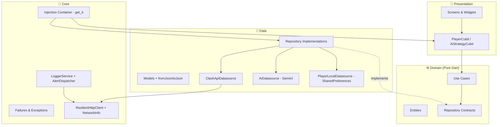

<p align="center">
  
</p>

<h1 align="center">CR AI Deck Builder</h1>

<p align="center">
  <strong>Flutter • Clean Architecture • Gemini AI</strong>
</p>

<p align="center">
  
  
  
  
  
</p>

---

## 📋 Visão Geral

Aplicativo Flutter que consome a **API oficial do Clash Royale** e utiliza **Google Gemini AI** para gerar relatórios estratégicos personalizados com sugestão de decks, coaching de meta-game e guias de batalha — tudo com base na coleção real do jogador.

O projeto foi arquitetado com foco em **resiliência**: interações rápidas (< 2 min), fallback offline via cache local, retry automático com backoff exponencial, e observabilidade estruturada pronta para integração com pipelines de monitoramento em produção.

> ⚠️ *This material is unofficial and is not endorsed by Supercell.*

---

## 🏗️ Arquitetura

O projeto segue **Clean Architecture** com separação rigorosa em três camadas, garantindo que a lógica de negócio nunca dependa de frameworks, APIs externas ou detalhes de UI.



### Por que Clean Architecture?

| Decisão | Justificativa |
|---|---|
| **Camadas desacopladas** | Permite trocar a API do Clash Royale por um mock sem tocar na UI. Permite trocar Gemini por OpenAI sem tocar nos use cases. |
| **Entidades puras** | `PlayerProfile`, `CrCard`, `AiStrategyReport` são Dart puro — sem dependência de Flutter, HTTP, ou Gemini. Testáveis em isolamento. |
| **Either<Failure, T>** | O domain layer nunca lança exceções. Erros são valores tipados (`ServerFailure`, `NetworkFailure`, `LlmFailure`), forçando o Cubit a tratar cada cenário. |
| **Use Cases** | `GetPlayerProfile` orquestra busca paralela de perfil + batalhas. `GetAiStrategy` valida regras de negócio antes de chamar a LLM. |
| **Repository Pattern** | Abstração que decide transparentemente se busca dados da API ou do cache local (offline-first). |

---

## 🔄 Gerenciamento de Estado

O app utiliza **BLoC/Cubit** (`flutter_bloc`) com estados tipados via `sealed class`:

```dart
sealed class PlayerState extends Equatable {}
class PlayerInitial extends PlayerState {}
class PlayerLoading extends PlayerState {}
class PlayerLoaded extends PlayerState { ... }
class PlayerError extends PlayerState { final Failure failure; }
```

O uso de `sealed class` + `switch expressions` garante **exhaustive matching** no Dart — o compilador força o tratamento de todos os estados. Nenhum cenário fica sem UI.

---

## 🛡️ Resiliência

### Cenários de Falha Tratados

| Cenário | Comportamento |
|---|---|
| **API timeout** | Retry automático (3x) com backoff exponencial (1s → 2s → 4s) |
| **Sem internet** | Detecção via `connectivity_plus` → fallback para cache local (SharedPreferences) |
| **API 404** | `PlayerNotFoundFailure` com mensagem amigável e botão de retry |
| **API 5xx** | `ServerFailure` + retry automático + alerta via `AlertDispatcher` |
| **LLM retorna JSON inválido** | Parser de 3 camadas: JSON direto → extração de code blocks → fallback com defaults |
| **LLM falha total** | 3 retries com backoff → `CRITICAL` alert → `LlmFailure` com botão de retry |
| **Crash de widget** | `ErrorWidget.builder` global substitui a "red screen" por UI amigável |

### Pipeline de Tratamento de Erros

```
DataSource throws Exception
    → Repository catches & converts to Either<Failure, T>
        → UseCase applies business rules
            → Cubit emits typed state
                → ErrorDisplayWidget renders with pattern matching
```

**Nenhuma exceção chega na UI.** Tudo é convertido em `Failure` tipado no boundary do Repository.

---

## 🤖 Integração com LLM (Gemini)

### Prompt Estruturado (JSON-First)

O prompt foi engenhado para forçar resposta JSON estruturada, com:
- `responseMimeType: 'application/json'` na configuração do Gemini
- Schema JSON explícito no prompt
- Instrução para NÃO incluir markdown ou texto extra

### Modelo Tipado com Tratamento de Alucinações

```dart
class AiStrategyReportModel extends AiStrategyReport {
  factory AiStrategyReportModel.fromLlmResponse(String rawResponse) {
    // Tier 1: Direct json.decode()
    // Tier 2: Extract from markdown code blocks (```json ... ```)
    // Tier 3: Throw LlmException with raw response for debugging
  }
}
```

Cada campo tem safe defaults — se o Gemini omitir `confidence_score`, o parser assume `0.7` ao invés de crashar.

### Output Tipado (não texto livre)

```dart
AiStrategyReport {
  playstyleAnalysis: String,
  metaCoaching: String,
  suggestedDeckIds: List<int>,
  suggestedDeckNames: List<String>,
  battleGuide: BattleGuide { opening, defense, winCondition },
  deckLinkUrl: String,  // Deep link pronto para importar no Clash Royale
  confidenceScore: double,
}
```

---

## 📡 Observabilidade

### LoggerService

Logging estruturado em JSON, compatível com cloud-native stacks:

```json
{
  "timestamp": "2026-04-03T23:31:58.000Z",
  "level": "ERROR",
  "message": "HTTP GET failed after 3 attempts",
  "url": "https://api.clashroyale.com/v1/players/%23TAG",
  "error": "NetworkException: Request timed out"
}
```

Em produção, estes logs seriam coletados por **GCP Cloud Logging** via Fluentd ou BigQuery sink.

### AlertDispatcher

Simula despacho de alertas críticos. Quando a LLM falha após todos os retries:

```json
{
  "severity": "CRITICAL",
  "source": "cr-ai-deck-builder",
  "device_id": "device-001",
  "event": "LLM_FAILURE",
  "message": "Gemini failed after 3 retries",
  "timestamp": "2026-04-03T23:31:58.000Z",
  "environment": "production"
}
```

Em produção, este payload seria enviado via **Cloud Function** → **Telegram Bot API** (canal de operações), integrando com agentes de monitoramento como os utilizados pelo time.

---

## 📂 Estrutura de Diretórios

```
lib/
├── main.dart                              # Entrypoint mínimo
├── app.dart                               # MaterialApp + tema + error boundary
├── core/
│   ├── constants/app_constants.dart        # Timeouts, retries, cache keys
│   ├── di/injection_container.dart         # get_it — DI com abstrações
│   ├── error/
│   │   ├── failures.dart                  # sealed class Failure hierarchy
│   │   └── exceptions.dart                # Typed data-layer exceptions
│   ├── network/
│   │   ├── http_client.dart               # Resilient HTTP + retry + backoff
│   │   └── network_info.dart              # Connectivity abstraction
│   └── observability/
│       ├── logger_service.dart            # Structured JSON logging
│       └── alert_dispatcher.dart          # Simulated Telegram/Sentry alerts
├── domain/
│   ├── entities/                           # Pure Dart, immutable, equatable
│   ├── repositories/                       # Abstract contracts
│   └── usecases/                           # Business orchestration
├── data/
│   ├── models/                             # fromJson/toJson + entity extension
│   ├── datasources/                        # API, LLM, SharedPreferences
│   └── repositories/                       # Implementations with error handling
├── presentation/
│   ├── blocs/                              # Cubits + sealed states
│   ├── screens/                            # SearchScreen, ProfileScreen
│   └── widgets/                            # ErrorDisplay, StrategyReportCard
└── services/
    └── ad_service.dart                     # AdMob (monetization only)
```

---

## 🚀 Setup & Execução

### Pré-requisitos

- Flutter SDK `^3.6.2`
- Dart SDK `^3.6.2`

### Configuração

1. Clone o repositório
2. Crie o arquivo `.env` na raiz:

```env
CLASH_ROYALE_API_KEY=your_key_here
GEMINI_API_KEY=your_key_here
ADMOB_APP_ID=ca-app-pub-xxx  # optional
```

3. Instale dependências e execute:

```bash
flutter pub get
flutter run
```

### Build de Produção

```bash
flutter build apk --release
flutter build web --release
```

---

## 🧪 Testes

```bash
flutter test                    # Unit tests
flutter analyze                 # Static analysis (0 errors)
```

Áreas cobertas por testes unitários:
- `AiStrategyReportModel.fromLlmResponse()` — payloads válidos, parciais e malformados
- Use cases — validações de negócio
- Repositories — comportamento online/offline

---

## 🔗 Alinhamento com Stack de Produção

| Stack do Time | Como este projeto se alinha |
|---|---|
| **GCP** | LoggerService emite JSON estruturado compatível com Cloud Logging. AlertDispatcher gera payloads prontos para Cloud Functions. |
| **Terraform** | A arquitetura de camadas facilita containerização. Cada camada poderia ser um módulo Terraform separado em uma arquitetura de microsserviços. |
| **TypeScript Backend** | O padrão Repository + Use Case é idêntico ao Clean Architecture em Node.js/TypeScript. A migração de conceitos é 1:1. |
| **Telegram Agents** | AlertDispatcher simula o envio de eventos estruturados para bots de monitoramento, com severity levels e device_id. |
| **Resiliência** | Timeout de 10s para API, 30s para LLM, retry 3x, cache offline — tudo otimizado para interações de até 2 minutos. |

---

## 📄 Licença

Este projeto é um aplicativo não-oficial de fã. Não é endossado pela Supercell.
Consulte a [Supercell Fan Content Policy](https://supercell.com/fan-content-policy).
